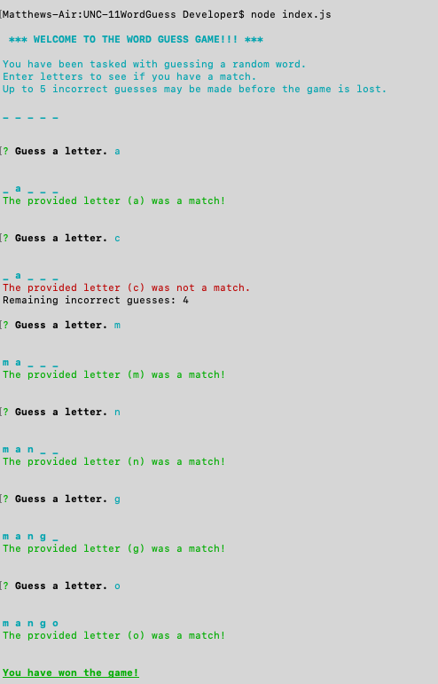

# Word Guess Game
## UNC Assignment #11

### Created by Matthew Farmer
__________________________________________________________________________________

### About
This application is a word guess game that utilizes NodeJS. Users may guess characters in order to determine the secret word. If the user guesses 5 letters incorrectly, the game is over. If the user uncovers the entire word before selecting 5 incorrect letters, the user wins the game. Users have the option to restart the game at the end of every session.

### Begin a Game
> node index.js 

The screenshot above shows a game from start to finish. Users are alerted of correct submissions, incorrect submissions, and once the game has ended.
__________________________________________________________________________________

### Technologies Used

This application is built on NodeJS. NPM packages utilized include Inquirer (for accepting user input) and Chalk (for formatting text output to the console).

### Other Notes

A video demonstration can be found at:
https://github.com/cafeamericano/UNC-11WordGuess/blob/master/videoDemo.mov
